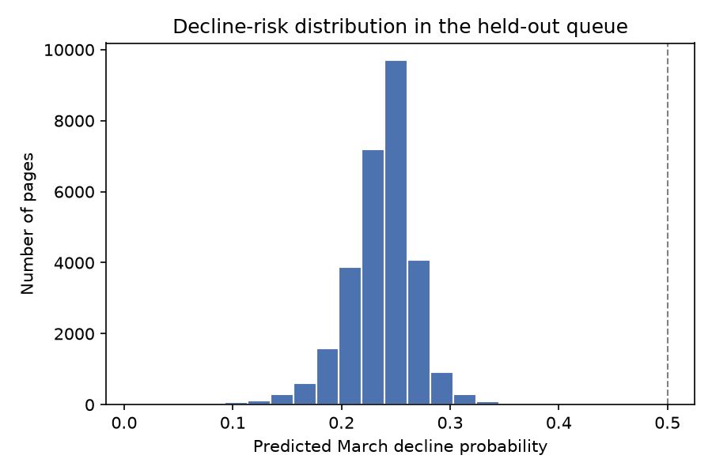
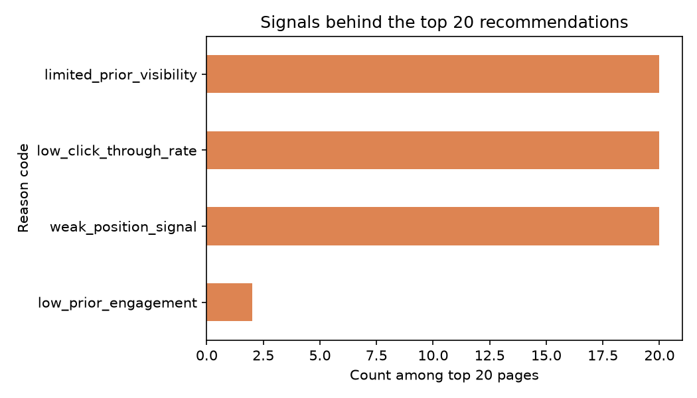

# Capstone Report — Ranking Signal Analysis

- **Author:** Jasper Nduagwuike
- **Lane:** Ranking Signal Analysis
- **Repo:** [Link Here](https://github.com/cjaynduagwuike/flyrank-ml-internship-starter)
- **Date:** 5th September 2026

## 1. Abstract

Search signals associated with changes in visibility, clicks, engagement, or movement are difficult to identify in large datasets. This paper examines apparent associations between search signals and these metrics. The model was trained on FlyRank SEO data from February 2026, with the decline label created from impressions in March 2026. It used a client-aware split and a binary decline label to rank pages according to their estimated risk of impression decline. Both the model and baseline achieved a Precision@20 of 35%, compared with a test-set decline base rate of 18.8%, so the model tied the simpler baseline in this run.

## 2. Problem framing

The model's ranked queue helps human page reviewers allocate resources to pages that may require further investigation. Rather than basing these choices on a rigid rule alone, a model that learns patterns in the data may help create an actionable human review queue. The cleaned cache contains one unique content item per client over February 2026 (`content_hash_id` x `client_hash_id`). The model outputs a ranked queue ordered by the estimated likelihood of an impression decline. The model will not be 100% correct, so human review is required before accepting its recommendations; an incorrect refresh recommendation wastes reviewer time and resources.

## 3. Data safety

The data used to train the model came from the FlyRank Hugging Face warehouse release `v20260703`, specifically the `fact_content_daily_performance` table, which contains 78,835,655 daily rows. The daily fact table was aggregated into a parquet table containing February features and March outcomes. February 1-28, 2026 was used as the feature window, and March 1-31, 2026 was used as the target window.

Columns such as `prior_impressions`, `prior_ctr`, `prior_avg_position`, `prior_sessions`, and `prior_engagement_rate` were used as model features. March 2026 features were not used as training features because they belong to the target window. The pseudonymous identifiers `client_hash_id` and `content_hash_id` were not used as predictive features. `client_hash_id` was retained only for grouped splitting and evaluation, while `content_hash_id` was retained for identifying output rows. `future_impressions` was excluded because it contains information from the target window, and `future_decline_label` was excluded because it is the target. The label-derived fields `trend_direction` and `trend_pct` were also excluded.

During the data aggregation phase, I took care to avoid introducing post-decision features into the cached dataset. No client-identifying markers were made public in the report or work products.

## 4. Baseline

The baseline was a transparent rule score built from the same February feature window. It is a fair comparison because it ranks the same eligible rows and is evaluated on the same held-out test rows using the same metric.

My baseline was calculated by assigning points to each reason code for an eligible page. Pages were eligible when they had at least 100 impressions during February 2026; eligibility did not use `future_decline_label` or any other March outcome. The baseline assigned points based on the reason codes attached to each page, with `limited_prior_visibility` receiving more influence than the other reason codes. `high_visibility_at_risk` was retained as a diagnostic reason code but was not included as an additional score weight.

```python
dataframe['high_visibility_at_risk'] = (
    (dataframe['prior_impressions'] >= 1000)
    & (dataframe['prior_avg_position'] > 10)
).astype(int)
dataframe['weak_position_signal'] = (
    dataframe['prior_avg_position'] > 10
).fillna(False).astype(int)
dataframe['low_prior_engagement'] = (
    (dataframe['prior_sessions'] > 0)
    & (dataframe['prior_engagement_rate'] < 0.30)
).fillna(False).astype(int)
dataframe['low_click_through_rate'] = (
    dataframe['prior_ctr'] < 0.01
).fillna(False).astype(int)
dataframe['limited_prior_visibility'] = (
    dataframe['prior_impressions'] < 1000
).astype(int)

dataframe['baseline_score'] = (
    3 * dataframe['limited_prior_visibility']
    + dataframe['weak_position_signal']
    + dataframe['low_prior_engagement']
    + dataframe['low_click_through_rate']
)
```

On the held-out test set, the baseline achieved a Precision@20 of 35% (7 of 20 rows). The eligible population contained approximately 80,322 rows, and the test-set decline base rate was 18.8%. I then compared the baseline with the model on the same client-aware split.

## 5. Model / analysis

I chose a ranking approach because the goal was to rank pages based on signals associated with changes in visibility or search performance. Logistic regression was selected as a simple and interpretable first model.

The model features were:

```python
model_features = ['prior_impressions', 'prior_clicks','prior_ctr','prior_avg_position', 'prior_sessions', 'prior_engagement_rate']
```

Excluded from the model features were:
- `client_hash_id`
- `content_hash_id`
- `future_decline_label`
- `future_impressions`
- `trend_direction`
- `trend_pct`

The target (`y`) was `future_decline_label`, a binary value of 0 or 1. A value of 1 was assigned when March impressions were less than 80% of February impressions, and 0 otherwise, for rows with at least 100 February impressions. The model predicted this binary outcome from the page's `prior_*` columns.

## 6. Evaluation

I used a client-aware split because the cached dataset was not large enough for a useful time-aware split. Specifically, I used `GroupShuffleSplit` with `test_size=0.3` and `random_state=42`, grouping by client. The model was trained on 51,418 rows and evaluated on 28,904 held-out rows. The model and baseline were evaluated on the same held-out test rows.

The results were:

<table>
  <thead>
    <tr>
      <!-- Added a solid border to the right of the metrics column -->
      <th style="border-right: 2px solid #555; padding-right: 15px; text-align: left;">Metric</th>
      <th style="padding-left: 15px; text-align: right;">Model</th>
      <th style="padding-left: 15px; text-align: right;">Baseline</th>
    </tr>
  </thead>
  <tbody>
    <tr>
      <td style="border-right: 2px solid #555; padding-right: 15px; font-weight: bold;">Base Rate</td>
      <td style="padding-left: 15px; text-align: right;">18.8%</td>
      <td style="padding-left: 15px; text-align: right;">18.8%</td>
    </tr>
    <tr>
      <td style="border-right: 2px solid #555; padding-right: 15px; font-weight: bold;">Precision@20</td>
      <td style="padding-left: 15px; text-align: right;">35% (7/20)</td>
      <td style="padding-left: 15px; text-align: right;">35% (7/20)</td>
    </tr>
    <tr>
      <td style="border-right: 2px solid #555; padding-right: 15px; font-weight: bold;">Train Rows</td>
      <td style="padding-left: 15px; text-align: right;">51,418</td>
      <td style="padding-left: 15px; text-align: right;">51,418</td>
    </tr>
    <tr>
      <td style="border-right: 2px solid #555; padding-right: 15px; font-weight: bold;">Test Rows</td>
      <td style="padding-left: 15px; text-align: right;">28,904</td>
      <td style="padding-left: 15px; text-align: right;">28,904</td>
    </tr>
  </tbody>
</table>


### Results charts



*Figure 1. Distribution of model probabilities on the evaluated pages. The probabilities support prioritization, but they are not guarantees that a page will decline.*



*Figure 2. Reason codes among the top-ranked review pages. These codes describe the February signals used to prioritize review.*

### Error analysis

The model produced 5,425 classification errors across the 28,904 held-out rows, an error rate of 18.8%. These errors include pages predicted to decline when they did not and pages that declined but were not predicted as declines. This is why the ranked queue should be treated as a review aid rather than an automatic refresh decision.

## 7. Interpretation

The model results show which features it relied on most during training. The features and their relative importance to the model's predictions were as follows:

<table>
  <thead>
    <tr>
      <th style="border-right: 2px solid #555; padding-right: 15px; text-align: left;">Top 3 Features</th>
      <th style="border-right: 2px solid #555; padding-right: 15px; padding-left: 15px; text-align: right;">Coefficient</th>
      <th style="padding-left: 15px; text-align: left;">Model Impact</th>
    </tr>
  </thead>
  <tbody>
    <tr>
      <td style="border-right: 2px solid #555; padding-right: 15px; font-weight: bold;">prior_ctr</td>
      <td style="border-right: 2px solid #555; padding-right: 15px; padding-left: 15px; text-align: right; font-family: monospace;">-0.1961</td>
      <td style="padding-left: 15px; text-align: left; color: #2e7d32;">Decreases risk</td>
    </tr>
    <tr>
      <td style="border-right: 2px solid #555; padding-right: 15px; font-weight: bold;">prior_sessions</td>
      <td style="border-right: 2px solid #555; padding-right: 15px; padding-left: 15px; text-align: right; font-family: monospace;">-0.1442</td>
      <td style="padding-left: 15px; text-align: left; color: #2e7d32;">Decreases risk</td>
    </tr>
    <tr>
      <td style="border-right: 2px solid #555; padding-right: 15px; font-weight: bold;">prior_impressions</td>
      <td style="border-right: 2px solid #555; padding-right: 15px; padding-left: 15px; text-align: right; font-family: monospace;">-0.1184</td>
      <td style="padding-left: 15px; text-align: left; color: #2e7d32;">Decreases risk</td>
    </tr>
  </tbody>
</table>

From the information above, the model assigned importance to features such as `prior_ctr`, `prior_sessions`, and `prior_impressions`. With the available information, these features appeared to have an association with a page's visibility and impression-decline risk. The model's reliance on these features does not mean that `prior_ctr`, `prior_sessions`, or `prior_impressions` cause changes in a page's visibility, because many other circumstances can affect visibility. In particular, `prior_sessions` represents session activity rather than overall page activity.

## 8. Recommendation

My work produced a ranked queue that recommends which pages editors should investigate first. Pages near the top of the queue may require a refresh or another action, but an editor should use human judgment when deciding whether to accept or decline the model's suggestion. I do not recommend that editors blindly accept the model's recommendations because the model was trained using a limited feature set to maintain simplicity, and it may miss changes caused by noise, seasonality, or other factors. The model was also affected by irregularities in the dates when clients' Google Search Console or Google Analytics data collection began; some clients had data beginning in the middle of the selected cutoff period, while others had data beginning later.

The recommended action order is:

1. Review the highest-ranked pages first and verify their data quality.
2. Check the page's editorial context, seasonality, and possible tracking gaps.
3. Decide manually whether a refresh, monitoring, or no action is appropriate.
4. Measure the result after any refresh rather than treating the model score as proof of impact.

## 9. Reproducibility

To rerun my analysis, install the dependencies and run the notebooks in sequence:

```bash
pip install -r requirements.txt
```
The validation split used `random_state=42`:

```python
random_state=42
```
Notebook links:
- [All Notebooks](https://github.com/cjaynduagwuike/flyrank-ml-internship-starter/tree/main/work/notebooks)
- [Model Notebook](https://github.com/cjaynduagwuike/flyrank-ml-internship-starter/blob/main/work/notebooks/w05_model.ipynb)
- [Capstone Notebook](https://github.com/cjaynduagwuike/flyrank-ml-internship-starter/blob/main/work/notebooks/capstone.ipynb)
- [Repository Link](https://github.com/cjaynduagwuike/flyrank-ml-internship-starter)

The notebooks should be run in sequence from the data contract and leakage checks through the baseline, model, validation audit, action playbook, and capstone notebook. The environment is defined in [`requirements.txt`](../requirements.txt).

## 10. Acknowledgments & Data credit
Built on the [FlyRank ML Internship dataset](https://flyrank.ai/). I would like to thank my instructors [Mirza Asceric](https://www.linkedin.com/in/mirzaasceric/) and [Alen Malkoc](https://www.linkedin.com/in/alenm/) for the opportunity.
